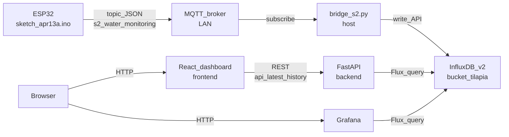
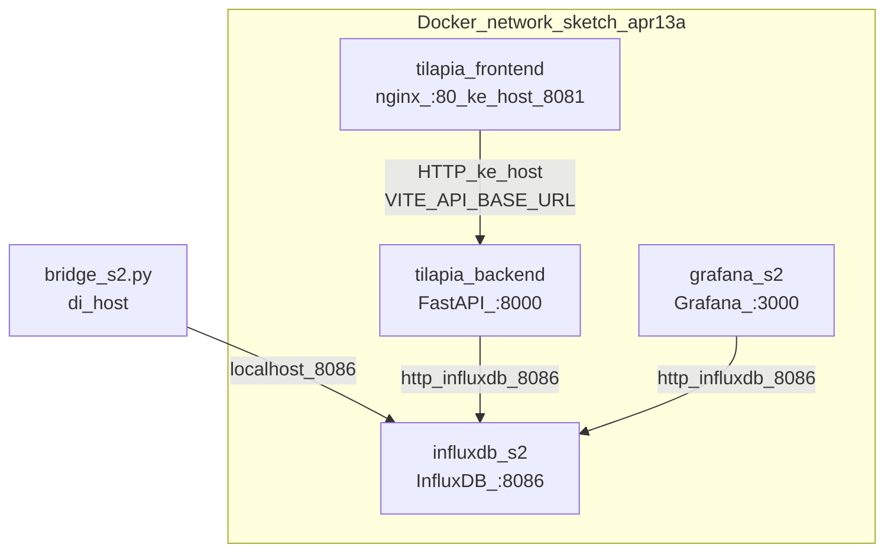
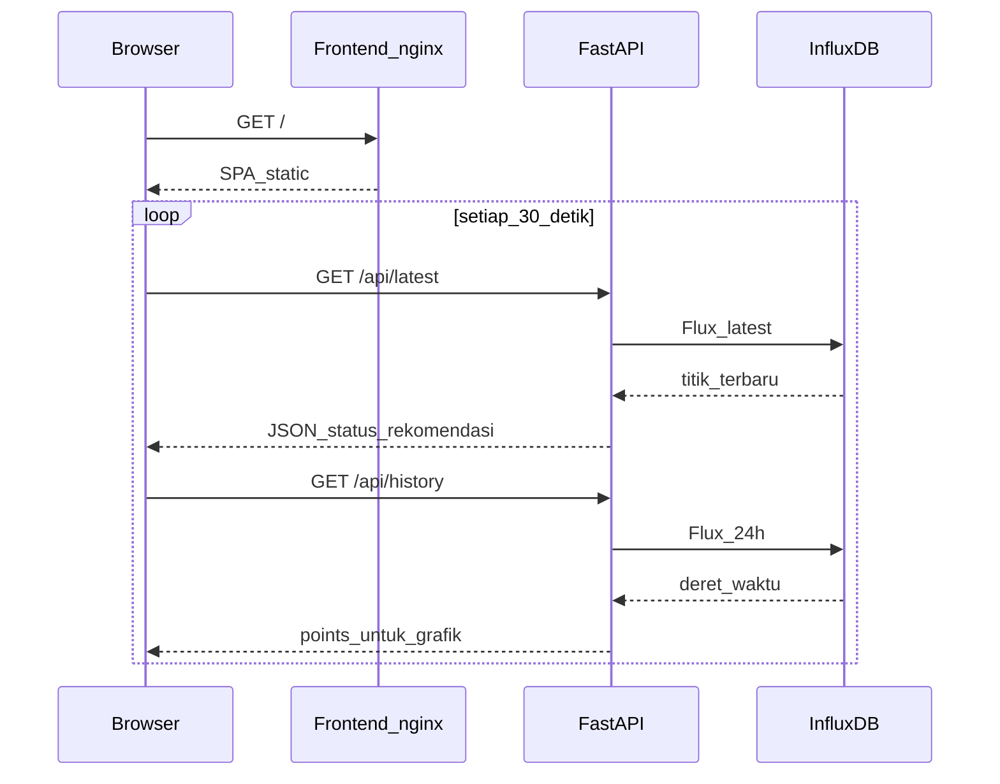

# Arsitektur sistem — Tilapia IoT

Dokumen ini menjelaskan **alur data** dan **komponen** proyek agar mudah dipahami di GitHub. Diagram memakai [Mermaid](https://mermaid.js.org/); GitHub merender Mermaid secara native di file `.md`.

---

## 1. Alur data utama (sensor → penyimpanan → aplikasi)

Alur waktu-nyata: sensor di kolam → broker MQTT → skrip bridge menulis ke InfluxDB → API dan dashboard membaca dari InfluxDB.

**Payload JSON (contoh):** `{"suhu": float, "ph": float, "tds": int}` — selaras dengan firmware dan parser `bridge_s2.py`.

---

## 2. Stack Docker Compose (jaringan kontainer)

Layanan yang biasanya dijalankan bersama dengan `docker compose up`. Backend berbicara ke InfluxDB lewat **hostname layanan** `influxdb`, bukan `localhost`.

| Layanan | Port host | Peran |
|---------|-----------|--------|
| `influxdb_s2` | 8086 | Time-series DB, bucket `tilapia_monitoring` |
| `grafana_s2` | 3000 | Dashboard analitis (Flux) |
| `tilapia_backend` | 8000 | REST `/api/latest`, `/api/history`, log CSV |
| `tilapia_frontend` | 8081 | UI React (static + nginx) |

---

## 3. Permintaan dashboard (baca data)

---

## 4. File & konfigurasi penting

| Lokasi | Fungsi |
|--------|--------|
| [`sketch_apr13a.ino`](sketch_apr13a.ino) | Firmware ESP32, publish MQTT |
| [`bridge_s2.py`](bridge_s2.py) | Subscriber MQTT → tulis Influx |
| [`backend/main.py`](backend/main.py) | API, integrasi `ai_engine`, log `decision_logs.csv` |
| [`frontend/src/App.tsx`](frontend/src/App.tsx) | Dashboard, Recharts, polling |
| [`.env`](.env) (root) | Token Influx untuk bridge |
| [`backend/.env`](backend/.env) | Token & org/bucket untuk API (Docker & lokal) |
| [`docker-compose.yml`](docker-compose.yml) | Orkestrasi layanan |

---

## 5. Catatan keamanan

- **Token InfluxDB** hanya dipakai di **host bridge** dan **backend** — jangan memasukkan token ke frontend atau repositori publik.
- Variabel `VITE_*` di frontend **terbaking** saat build; hanya URL API, bukan rahasia DB.

---

_Group 1 — S2 / IoT Tilapia_
