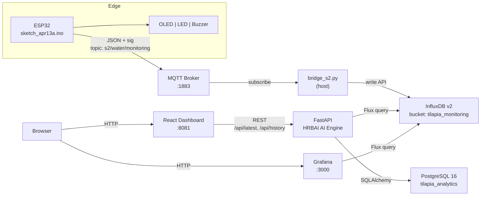
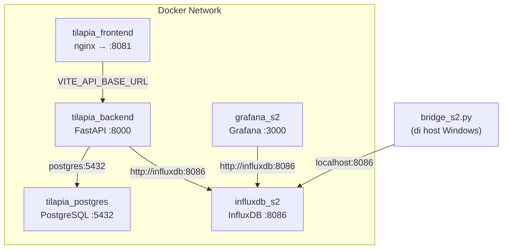
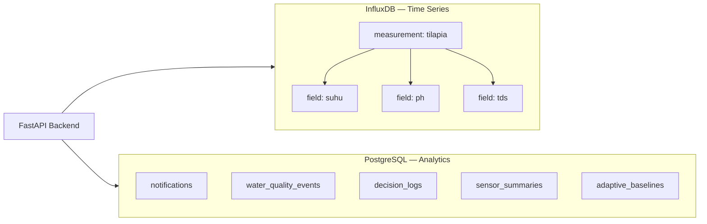
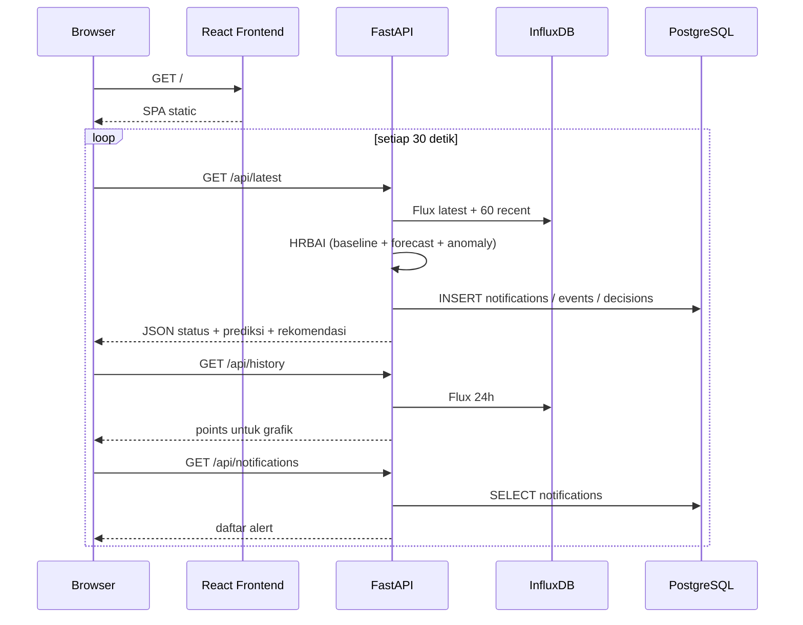

# Arsitektur sistem — Tilapia IoT

> **Dokumentasi lengkap** (ERD, AI/HRBAI, flowchart, Docker, kredensial, pengujian): **[DOCUMENTATION.md](DOCUMENTATION.md)**

Dokumen ini menjelaskan **alur data** dan **komponen** proyek agar mudah dipahami di GitHub. Diagram memakai [Mermaid](https://mermaid.js.org/); GitHub merender Mermaid secara native di file `.md`.

---

## 1. Alur data utama (sensor → penyimpanan → aplikasi)

Alur waktu-nyata: sensor di kolam → ESP32 (edge filter + SHA256) → broker MQTT → bridge menulis InfluxDB → FastAPI (HRBAI + PostgreSQL) → dashboard React & Grafana.


```mermaid
flowchart LR
  subgraph EDGE["Edge"]
    ESP32["ESP32\nsketch_apr13a.ino"]
    ACT["OLED | LED | Buzzer"]
    ESP32 --> ACT
  end

  MQTT["MQTT Broker\n:1883"]
  Bridge["bridge_s2.py\n(host)"]
  Influx["InfluxDB v2\nbucket: tilapia_monitoring"]
  PG["PostgreSQL 16\ntilapia_analytics"]
  API["FastAPI\nHRBAI AI Engine"]
  UI["React Dashboard\n:8081"]
  Graf["Grafana\n:3000"]
  Browser["Browser"]

  ESP32 -->|"JSON + sig\ntopic: s2/water/monitoring"| MQTT
  MQTT -->|"subscribe"| Bridge
  Bridge -->|"write API"| Influx
  API -->|"Flux query"| Influx
  API -->|"SQLAlchemy"| PG
  Graf -->|"Flux query"| Influx
  Browser -->|"HTTP"| UI
  Browser -->|"HTTP"| Graf
  UI -->|"REST\n/api/latest, /api/history"| API
```

**Payload MQTT (contoh):**

```json
{
  "suhu": 29.8,
  "ph": 6.73,
  "tds": 58,
  "status": "WARNING",
  "device": "ESP32_S2_TILAPIA",
  "sig": "964b6c61dc8ba69a..."
}
```

---

## 2. Lapisan sistem

| Lapisan | Komponen | Peran |
|---------|----------|-------|
| **Edge** | ESP32 | Baca sensor, klasifikasi 4 level, aktuator lokal, publish MQTT |
| **Transport** | MQTT broker | Pub/sub topic `s2/water/monitoring` |
| **Bridge** | `bridge_s2.py` | Subscribe MQTT → validasi JSON → tulis InfluxDB |
| **Time-series DB** | InfluxDB | Raw suhu, pH, TDS per timestamp |
| **Analytics DB** | PostgreSQL | Notifikasi, event, decision log |
| **Application** | FastAPI | REST API, HRBAI, business logic |
| **Presentation** | React + Grafana | Dashboard operasional & analitik |

---

## 3. Stack Docker Compose (5 services)

Layanan dijalankan dengan `docker compose up`. Backend berbicara ke InfluxDB lewat hostname **`influxdb`**, PostgreSQL lewat **`postgres`**.


```mermaid
flowchart TB
  subgraph compose["Docker Network"]
    influxdb_s2["influxdb_s2\nInfluxDB :8086"]
    tilapia_postgres["tilapia_postgres\nPostgreSQL :5432"]
    tilapia_backend["tilapia_backend\nFastAPI :8000"]
    tilapia_frontend["tilapia_frontend\nnginx → :8081"]
    grafana_s2["grafana_s2\nGrafana :3000"]
  end

  HostBridge["bridge_s2.py\n(di host Windows)"]
  HostBridge -->|"localhost:8086"| influxdb_s2
  tilapia_backend -->|"http://influxdb:8086"| influxdb_s2
  tilapia_backend -->|"postgres:5432"| tilapia_postgres
  grafana_s2 -->|"http://influxdb:8086"| influxdb_s2
  tilapia_frontend -->|"VITE_API_BASE_URL"| tilapia_backend
```

| Service | Container | Port host | Peran |
|---------|-----------|-----------|-------|
| `influxdb` | `influxdb_s2` | 8086 | Time-series DB, org `S2_Project`, bucket `tilapia_monitoring` |
| `postgres` | `tilapia_postgres` | 5432 | Analytics DB `tilapia_analytics` |
| `backend` | `tilapia_backend` | 8000 | REST API + HRBAI + notifikasi |
| `frontend` | `tilapia_frontend` | 8081 | UI React (static + nginx) |
| `grafana` | `grafana_s2` | 3000 | Dashboard Flux (auto-provisioned) |

**Catatan:** `bridge_s2.py` **tidak** di Docker — dijalankan di host agar bisa reach MQTT broker LAN dan InfluxDB via `localhost:8086`.

---

## 4. Dual database


```mermaid
flowchart LR
  subgraph INFLUX["InfluxDB — Time Series"]
    M["measurement: tilapia"]
    F1["field: suhu"]
    F2["field: ph"]
    F3["field: tds"]
    M --> F1 & F2 & F3
  end

  subgraph PG["PostgreSQL — Analytics"]
    T1["notifications"]
    T2["water_quality_events"]
    T3["decision_logs"]
    T4["sensor_summaries"]
    T5["adaptive_baselines"]
  end

  BE["FastAPI Backend"] --> INFLUX
  BE --> PG
```

| Data | Database | Alasan |
|------|----------|--------|
| Raw suhu, pH, TDS + timestamp | **InfluxDB** | Optimized time-series |
| Notifikasi alert | **PostgreSQL** | Query relational, mark read |
| Event perubahan status | **PostgreSQL** | Timeline analisis |
| Decision log AI | **PostgreSQL** | Bukti keputusan adaptif |

---

## 5. Edge layer (ESP32)

| Komponen | Pin GPIO | Keterangan |
|----------|----------|------------|
| DS18B20 (Suhu) | 4 | OneWire |
| pH 4502C | 34 | ADC, kalibrasi 2 titik (slope −5.65, intercept 21.12) |
| TDS Sensor | 35 | ADC, polinomial ppm |
| Buzzer | 27 | Alert Danger/Critical |
| LED Safe | 25 | ON saat kondisi aman |
| LED Danger | 26 | ON saat Danger/Critical |
| OLED SSD1306 | I2C 0x3C | Display status + nilai sensor |

**Edge filter:** publish MQTT hanya jika Δ suhu ≥ 0.3 °C, Δ pH ≥ 0.05, atau Δ TDS ≥ 5 ppm (interval baca 5 detik).

---

## 6. HRBAI — Mesin AI (`ai_engine.py`)

**HRBAI** (Hybrid Rule-Based Adaptive Intelligence) — bukan LSTM production; modul statistik + rules data-driven dari histori InfluxDB.

| Layer | Fungsi |
|-------|--------|
| Adaptive Baseline | Mean ± 1.5×std per parameter (clamped ke batas biologis) |
| Trend Forecast | Linear extrapolation 15 menit ke depan |
| Anomaly Detection | Z-score > 2.5 |
| Decision Engine | `WARNING_CHANGE_WATER` jika trajectory menuju Danger |

---

## 7. Permintaan dashboard (polling 30 detik)


```mermaid
sequenceDiagram
  participant B as Browser
  participant F as React Frontend
  participant A as FastAPI
  participant I as InfluxDB
  participant P as PostgreSQL

  B->>F: GET /
  F-->>B: SPA static

  loop setiap 30 detik
    B->>A: GET /api/latest
    A->>I: Flux latest + 60 recent
    A->>A: HRBAI (baseline + forecast + anomaly)
    A->>P: INSERT notifications / events / decisions
    A-->>B: JSON status + prediksi + rekomendasi

    B->>A: GET /api/history
    A->>I: Flux 24h
    A-->>B: points untuk grafik

    B->>A: GET /api/notifications
    A->>P: SELECT notifications
    A-->>B: daftar alert
  end
```

---

## 8. Frontend components

| Komponen | Fungsi |
|----------|--------|
| `StatusPanel` | Panel status 4-level (Normal/Warning/Danger/Critical) |
| `MetricCard` | Kartu suhu/pH/TDS + sparkline + zone badge |
| `SensorChart` | Line chart 24h + reference band ideal |
| `RecommendationBox` | Rekomendasi AI + prediksi 15 menit |
| `EventTimeline` | Riwayat perubahan status dari PostgreSQL |
| `NotifBell` | Bell icon + dropdown notifikasi |

---

## 9. File & konfigurasi penting

| Lokasi | Fungsi |
|--------|--------|
| [`sketch_apr13a.ino`](sketch_apr13a.ino) | Firmware ESP32 — sensor, edge filter, SHA256, aktuator |
| [`bridge_s2.py`](bridge_s2.py) | Subscriber MQTT → tulis InfluxDB |
| [`backend/main.py`](backend/main.py) | API REST, orchestration HRBAI + PostgreSQL |
| [`backend/ai_engine.py`](backend/ai_engine.py) | HRBAI — baseline, forecast, anomaly |
| [`backend/thresholds.py`](backend/thresholds.py) | Batas biologis nila (4 zona) |
| [`frontend/src/App.tsx`](frontend/src/App.tsx) | Dashboard, polling, komponen UI |
| [`docker-compose.yml`](docker-compose.yml) | Orkestrasi 5 layanan |
| [`grafana/provisioning/`](grafana/provisioning/) | Auto-config datasource InfluxDB |
| [`.env`](.env) | Token Influx + MQTT untuk bridge |
| [`backend/.env`](backend/.env) | Token, DATABASE_URL untuk API |

---

## 10. Keamanan IoT

| Layer | Implementasi | File |
|-------|--------------|------|
| WiFi audit | Deteksi OPEN/WEP/WPA2 | `sketch_apr13a.ino` |
| Payload integrity | SHA256 signature field `sig` | ESP32 + `bridge_s2.py` |
| Secret key | `PAYLOAD_SECRET` | `.env` |
| Verifikasi bridge | `VERIFY_SIGNATURE` (opsional) | `.env` |
| API secrets | Token Influx hanya di backend | `backend/.env` |
| Frontend | Hanya `VITE_API_BASE_URL` | `frontend/.env` |

---

## 11. Threshold kualitas air nila

Sumber: `backend/thresholds.py` (selaras `classifyStatus()` di ESP32)

| Parameter | Ideal | Warning | Danger | Critical |
|-----------|-------|---------|-------|
| pH | 6.5 – 8.5 | 6.0–6.5 / 8.5–9.0 | 5.0–6.0 / 9.0–9.5 | < 5.0 / > 9.5 |
| TDS (ppm) | 100 – 400 | 50–100 / 400–500 | 0–50 / 500–1000 | > 1000 |
| Suhu (°C) | 26 – 30 | 22–26 / 30–33 | 20–22 / 33–35 | < 20 / > 35 |

---

_Group 1 — S2 / IoT Tilapia_
