# DOCUMENTATION — Smart Water Change Alert System (Tilapia IoT)

**Group 1 — S2 / IoT Tilapia**  
Dokumentasi end-to-end: arsitektur IoT, alur kode, ERD, AI/prediktif, Docker, Backend, Frontend, Grafana, dan bukti implementasi.

---

## Daftar Isi

1. [Ringkasan Proyek](#1-ringkasan-proyek)
2. [Arsitektur Sistem End-to-End](#2-arsitektur-sistem-end-to-end)
3. [Arsitektur IoT (Edge Layer)](#3-arsitektur-iot-edge-layer)
4. [Docker Compose & Jaringan Kontainer](#4-docker-compose--jaringan-kontainer)
5. [Alur Data (Data Flow)](#5-alur-data-data-flow)
6. [Flowchart Operasional](#6-flowchart-operasional)
7. [Struktur Kode & Modul](#7-struktur-kode--modul)
8. [Backend API](#8-backend-api)
9. [Database: Dual Storage (InfluxDB + PostgreSQL)](#9-database-dual-storage-influxdb--postgresql)
10. [ERD PostgreSQL](#10-erd-postgresql)
11. [Mesin AI / Prediktif (Adaptive Intelligence)](#11-mesin-ai--prediktif-adaptive-intelligence)
12. [Frontend Dashboard](#12-frontend-dashboard)
13. [Grafana](#13-grafana)
14. [Keamanan IoT (Security Layer)](#14-keamanan-iot-security-layer)
15. [Threshold Kualitas Air Nila](#15-threshold-kualitas-air-nila)
16. [Kredensial & Akses](#16-kredensial--akses)
17. [Cara Menjalankan Proyek](#17-cara-menjalankan-proyek)
18. [Pengujian & Bukti Implementasi](#18-pengujian--bukti-implementasi)
19. [Peta File Proyek](#19-peta-file-proyek)

---

## 1. Ringkasan Proyek

**Smart Water Change Alert System** adalah sistem IoT untuk monitoring kualitas air kolam ikan nila (*Oreochromis niloticus*). Sistem membaca **suhu**, **pH**, dan **TDS** dari sensor, mengirim data via **MQTT**, menyimpan time-series di **InfluxDB**, menjalankan **analisis adaptif + prediksi** di **Backend FastAPI**, menyimpan event/analytics di **PostgreSQL**, dan menampilkan hasil di **Dashboard React** serta **Grafana**.

### Fitur utama

| Fitur | Implementasi |
|-------|----------------|
| Monitoring real-time | ESP32 + OLED + MQTT |
| Time-series storage | InfluxDB v2 |
| Analytics & alert persistence | PostgreSQL |
| Adaptive intelligence | `ai_engine.py` (baseline + forecast + z-score) |
| Notifikasi | PostgreSQL + bell UI + browser notification |
| Visualisasi | React dashboard + Grafana |
| Edge optimization | Filter delta sebelum publish MQTT |
| Security simulation | SHA256 payload signature, WiFi audit |
| Orkestrasi | Docker Compose |

---

## 2. Arsitektur Sistem End-to-End

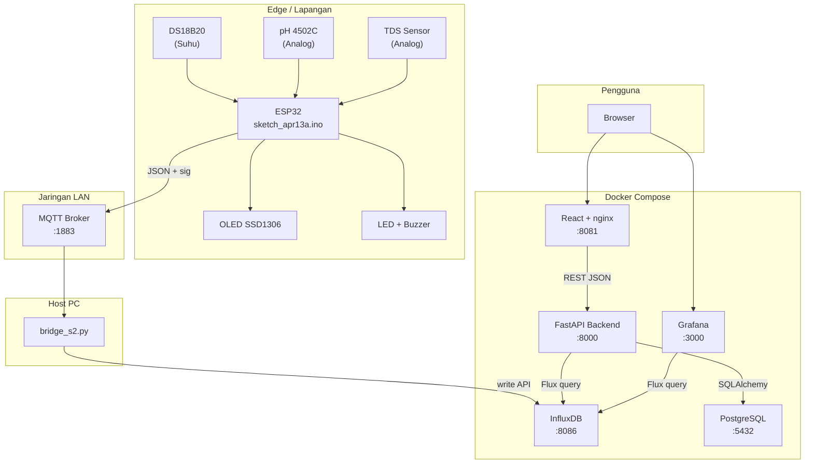

### Penjelasan lapisan

| Lapisan | Komponen | Peran |
|---------|----------|-------|
| **Edge** | ESP32 | Baca sensor, klasifikasi lokal, aktuator, publish MQTT |
| **Transport** | MQTT broker | Pub/sub topic `s2/water/monitoring` |
| **Bridge** | `bridge_s2.py` | Subscribe MQTT → tulis InfluxDB |
| **Time-series DB** | InfluxDB | Raw sensor per timestamp |
| **Analytics DB** | PostgreSQL | Notifikasi, event, decision log |
| **Application** | FastAPI | AI engine, REST API, business logic |
| **Presentation** | React + Grafana | Dashboard operasional & analitik |

---

## 3. Arsitektur IoT (Edge Layer)

### Hardware & pin ESP32

| Komponen | Pin GPIO | Keterangan |
|----------|----------|------------|
| Sensor suhu DS18B20 | 4 | OneWire |
| Sensor pH 4502C | 34 | ADC, kalibrasi 2 titik |
| Sensor TDS | 35 | ADC, polinomial ppm |
| Buzzer | 27 | Alert saat Danger/Critical |
| LED Safe | 25 | ON saat kondisi aman |
| LED Danger | 26 | ON saat Danger/Critical |
| OLED SSD1306 | I2C 0x3C | Display status + nilai sensor |

### Diagram edge

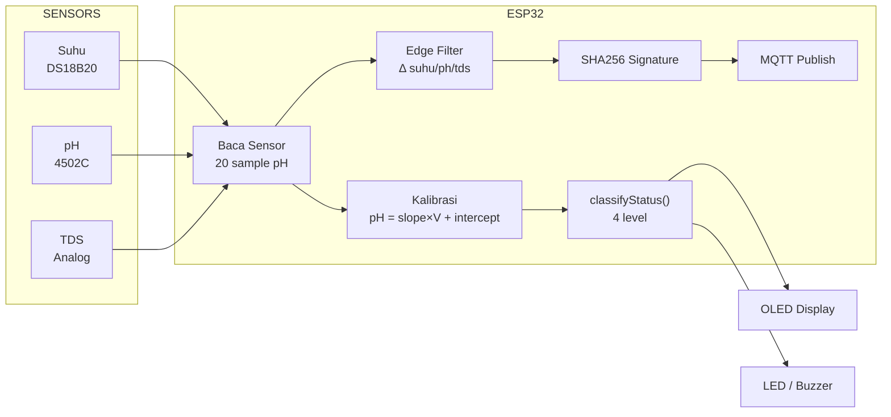

### Rumus sensor

**pH (kalibrasi 2 titik):**
```
V = (ADC_avg / 4095) × 3.3
pH = (slope × V) + intercept    // slope=-5.65, intercept=21.12
```

**TDS:**
```
V = (ADC × 3.3) / 4095
TDS = (133.42×V³ − 255.86×V² + 857.39×V) × 0.5
```

**Payload MQTT (contoh):**
```json
{
  "suhu": 29.8,
  "ph": 6.73,
  "tds": 58,
  "status": "WARNING",
  "device": "ESP32_S2_TILAPIA",
  "sig": "964b6c61dc8ba69a..."
}
```

### Edge filter

ESP32 hanya publish jika perubahan signifikan:
- Δ suhu ≥ 0.3 °C
- Δ pH ≥ 0.05
- Δ TDS ≥ 5 ppm

Interval pembacaan: **5 detik**.

---

## 4. Docker Compose & Jaringan Kontainer

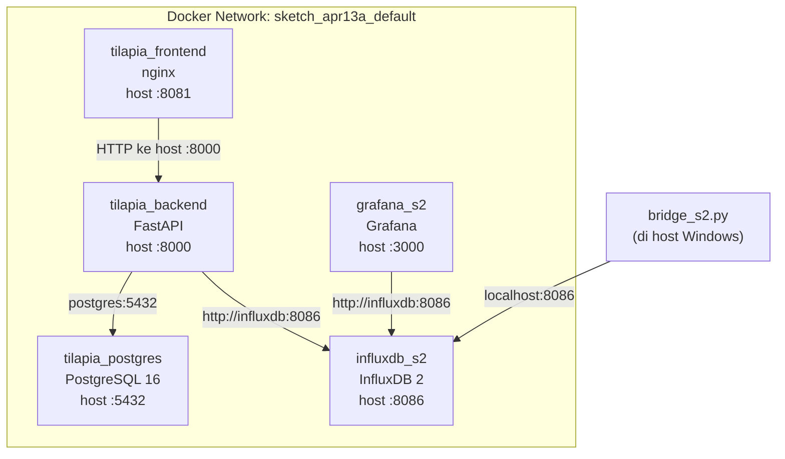

### Tabel layanan Docker

| Service | Container | Image | Port Host | Volume |
|---------|-----------|-------|-----------|--------|
| `influxdb` | `influxdb_s2` | influxdb:2 | 8086 | `influxdb_data` |
| `postgres` | `tilapia_postgres` | postgres:16-alpine | 5432 | `postgres_data` |
| `backend` | `tilapia_backend` | build `./backend` | 8000 | `./backend/logs` |
| `frontend` | `tilapia_frontend` | build `./frontend` | 8081 | — |
| `grafana` | `grafana_s2` | grafana:latest | 3000 | `grafana_data` + provisioning |

**Catatan:** `bridge_s2.py` **tidak** di Docker — dijalankan di host agar bisa reach MQTT broker LAN dan InfluxDB via `localhost:8086`.

---

## 5. Alur Data (Data Flow)

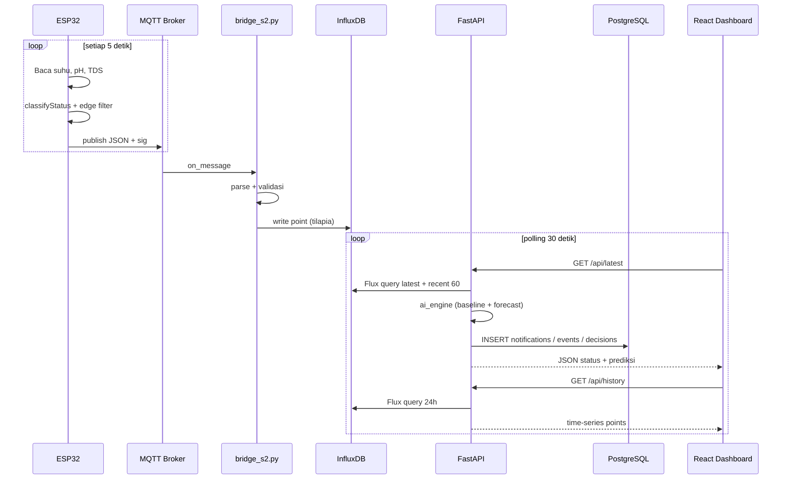

### Pembagian data antar database

| Data | Database | Alasan |
|------|----------|--------|
| Raw suhu, pH, TDS + timestamp | **InfluxDB** | Optimized untuk time-series |
| Notifikasi alert | **PostgreSQL** | Query relational, mark read |
| Event perubahan status | **PostgreSQL** | Timeline analisis |
| Decision log AI | **PostgreSQL** | Bukti Bab 4 / thesis |
| Hourly summary (rencana) | **PostgreSQL** | Agregat analisis jangka panjang |

---

## 6. Flowchart Operasional

### 6.1 Flowchart ESP32 (`loop()`)

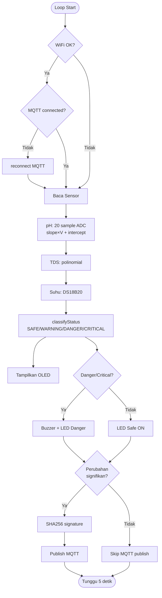

### 6.2 Flowchart Backend `/api/latest`

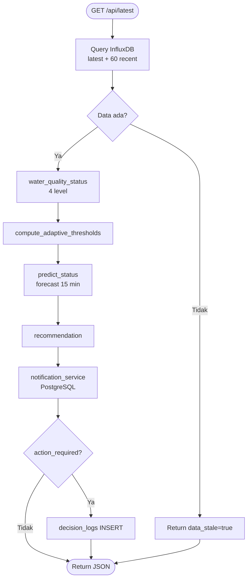

### 6.3 Flowchart Frontend polling

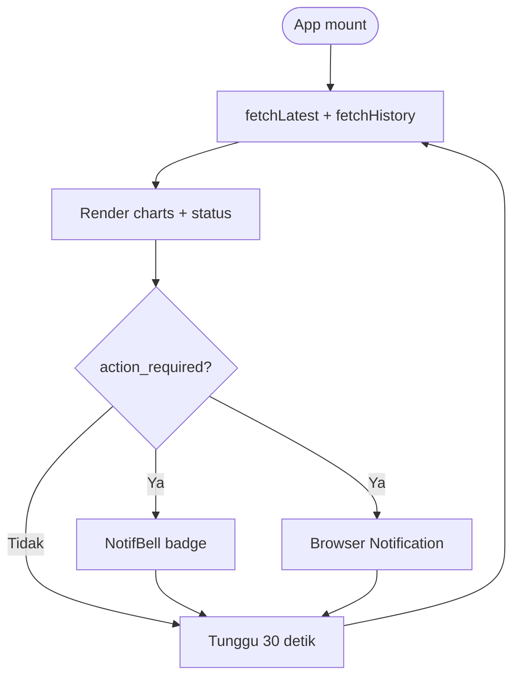

---

## 7. Struktur Kode & Modul

### 7.1 Backend (`backend/`)

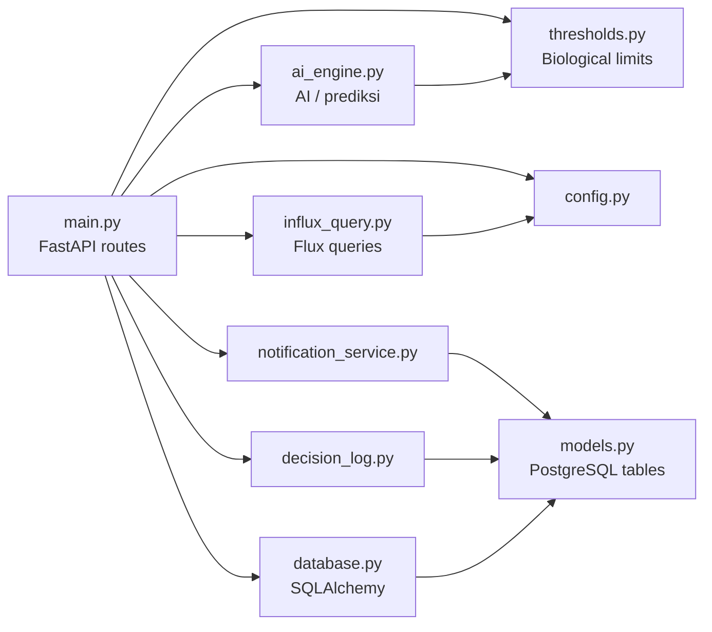

| File | Fungsi |
|------|--------|
| `main.py` | Endpoint REST, lifespan, orchestration |
| `ai_engine.py` | Adaptive baseline, forecast, anomaly, rekomendasi |
| `thresholds.py` | Konstanta batas biologis nila |
| `influx_query.py` | Query Flux: latest, history 24h, recent |
| `database.py` | Engine PostgreSQL, session, init tables |
| `models.py` | ORM: 5 tabel analytics |
| `notification_service.py` | Buat notif + event, dedup 30 menit |
| `decision_log.py` | Persist keputusan AI ke PostgreSQL |
| `config.py` | Environment variables |

### 7.2 Frontend (`frontend/src/`)

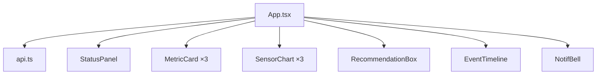

| Komponen | Fungsi |
|----------|--------|
| `StatusPanel` | Panel status 4-level (Normal/Warning/Danger/Critical) |
| `MetricCard` | Kartu suhu/pH/TDS + sparkline + zone badge |
| `SensorChart` | Line chart 24h + reference band ideal |
| `RecommendationBox` | Rekomendasi AI + prediksi 15 menit |
| `EventTimeline` | Riwayat perubahan status dari PostgreSQL |
| `NotifBell` | Bell icon + dropdown notifikasi |

### 7.3 Bridge & Firmware

| File | Fungsi |
|------|--------|
| `sketch_apr13a.ino` | Firmware ESP32 lengkap |
| `bridge_s2.py` | MQTT subscriber → InfluxDB writer |

---

## 8. Backend API

Base URL: `http://localhost:8000`  
Dokumentasi interaktif: `http://localhost:8000/docs`

| Method | Endpoint | Sumber Data | Deskripsi |
|--------|----------|-------------|-----------|
| GET | `/api/health` | — | Health check |
| GET | `/api/thresholds` | `thresholds.py` | Batas biologis untuk chart band |
| GET | `/api/latest` | InfluxDB + AI + PG | Snapshot + prediksi + notif side-effect |
| GET | `/api/history` | InfluxDB | Time-series 24 jam |
| GET | `/api/notifications` | PostgreSQL | Daftar alert |
| GET | `/api/notifications/unread-count` | PostgreSQL | Badge count |
| PATCH | `/api/notifications/{id}/read` | PostgreSQL | Tandai dibaca |
| PATCH | `/api/notifications/read-all` | PostgreSQL | Tandai semua dibaca |
| GET | `/api/events` | PostgreSQL | Timeline status |
| GET | `/api/analytics/summary` | PostgreSQL | Hourly summary |
| GET | `/api/analytics/baseline` | InfluxDB → AI | Adaptive threshold saat ini |
| GET | `/api/decisions` | PostgreSQL | Log keputusan AI |

### Contoh response `/api/latest`

```json
{
  "time": "2026-05-24T13:47:48Z",
  "suhu": 29.8,
  "ph": 6.67,
  "tds": 69,
  "suhu_zone": "ideal",
  "ph_zone": "ideal",
  "tds_zone": "warning",
  "water_quality_status": "Warning",
  "ai_status": "OK",
  "predicted_ph": 6.72,
  "predicted_tds": 75,
  "predicted_suhu": 29.9,
  "horizon_minutes": 15,
  "confidence": 0.65,
  "recommendation": "Parameter mendekati batas. Monitor ketat, siapkan air pengganti.",
  "action_required": false,
  "anomalies": [],
  "adaptive": {
    "ph_mean": 6.68,
    "ph_adaptive_low": 6.5,
    "ph_adaptive_high": 7.1,
    "sample_count": 60
  }
}
```

---

## 9. Database: Dual Storage (InfluxDB + PostgreSQL)

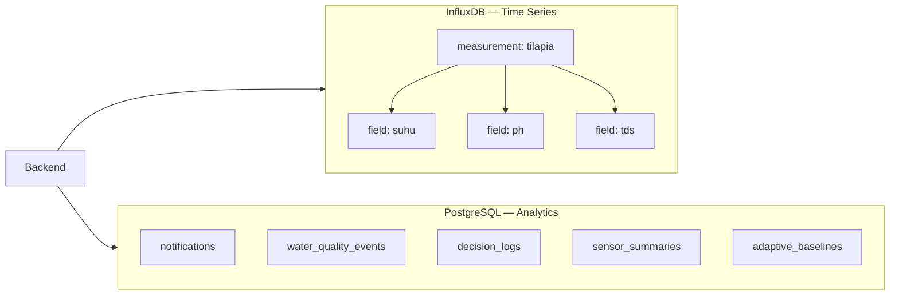

### InfluxDB schema

| Properti | Nilai |
|----------|-------|
| Organization | `S2_Project` |
| Bucket | `tilapia_monitoring` |
| Measurement | `tilapia` |
| Fields | `suhu` (float), `ph` (float), `tds` (int) |
| Timestamp | Auto saat write dari bridge |

### Flux query contoh (Data Explorer)

```flux
from(bucket: "tilapia_monitoring")
  |> range(start: -6h)
  |> filter(fn: (r) => r._measurement == "tilapia")
  |> filter(fn: (r) => r._field == "suhu" or r._field == "ph" or r._field == "tds")
  |> pivot(rowKey: ["_time"], columnKey: ["_field"], valueColumn: "_value")
```

---

## 10. ERD PostgreSQL

Database: `tilapia_analytics`  
Schema: `public`

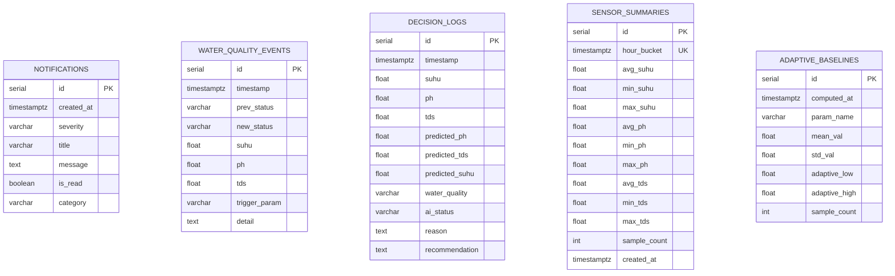

### Relasi logis (tanpa FK fisik)

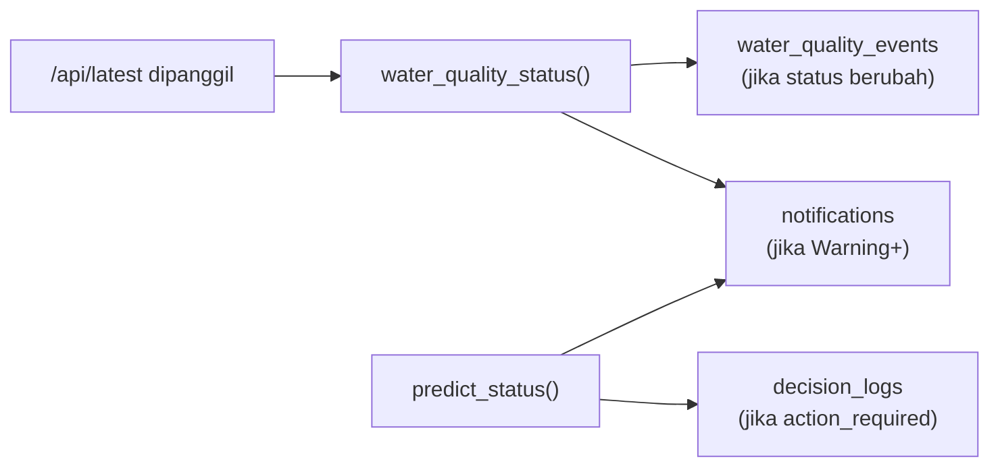

| Tabel | Trigger isi data | Kapan |
|-------|------------------|-------|
| `notifications` | `notification_service.py` | Status ≥ Warning atau prediksi buruk |
| `water_quality_events` | `notification_service.py` | Transisi status (Normal→Warning, dll.) |
| `decision_logs` | `decision_log.py` | Danger/Critical atau WARNING_CHANGE_WATER |
| `sensor_summaries` | *(rencana sync job)* | Agregat per jam dari Influx |
| `adaptive_baselines` | *(rencana persist)* | Saat baseline dihitung |

### Cara lihat ERD di DBeaver

1. Connect PostgreSQL (`tilapia` / `tilapia_s2_secure` / `tilapia_analytics`)
2. Pilih semua tabel di schema `public`
3. Klik kanan → **View Diagram**

---

## 11. Mesin AI / Prediktif (Adaptive Intelligence)

Implementasi: **HRBAI — Hybrid Rule-Based Adaptive Intelligence**  
File: `backend/ai_engine.py`

> Bukan model deep learning (LSTM) di production saat ini, melainkan **simulated ML** berbasis statistik + rules yang **data-driven** dari histori InfluxDB — sesuai requirement Final Project adaptive intelligence tanpa cloud GPU berbayar.

### 11.1 Arsitektur AI Engine

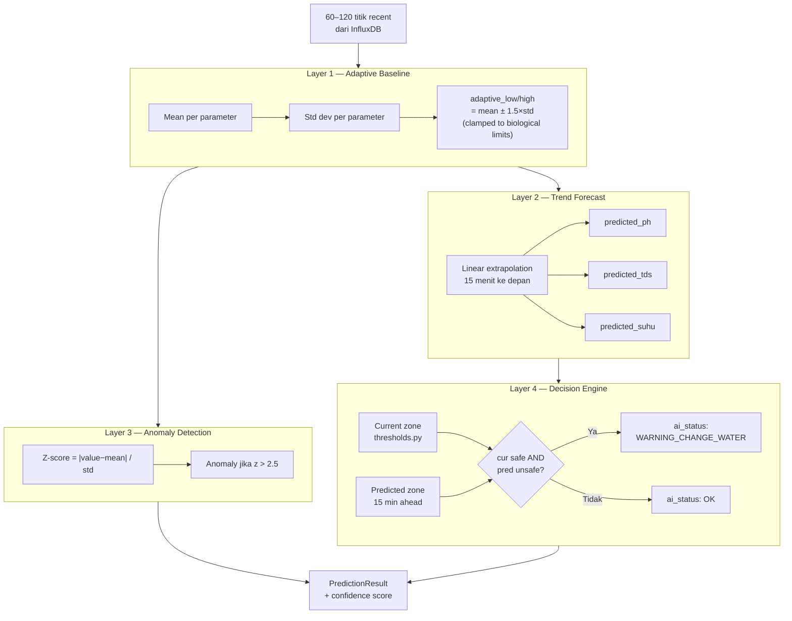

### 11.2 Algoritma detail

#### A. Adaptive Baseline (`compute_adaptive_thresholds`)

```
Untuk setiap parameter (ph, tds, suhu):
  mean = Σ values / n
  std  = sqrt(Σ(value − mean)² / (n−1))
  adaptive_low  = max(biological_ideal_low,  mean − 1.5 × std)
  adaptive_high = min(biological_ideal_high, mean + 1.5 × std)
```

**Bukti implementasi:** fungsi `compute_adaptive_thresholds()` di `ai_engine.py` baris 55–101.

#### B. Linear Forecast (`_linear_forecast`)

```
slope = (last_value − first_value) / time_span_seconds
predicted = last_value + slope × (15 × 60)
```

Horizon: **15 menit** — diprediksi untuk pH, TDS, dan suhu.

#### C. Confidence Score (`_compute_confidence`)

```
confidence = 0.5 × min(n_points/60, 1.0) + 0.5 × min(time_span/3600, 1.0)
```

Semakin banyak data & rentang waktu panjang → confidence lebih tinggi (0.0–1.0).

#### D. Anomaly Detection (`_detect_anomalies`)

```
z_score = |current_value − mean| / std
Jika z > 2.5 → catat anomaly (contoh: "pH anomaly (z=3.1)")
```

#### E. Status Klasifikasi (`water_quality_status`)

Menggunakan `thresholds.py` — 4 zona per parameter, ambil **worst case**:

| Level | Label API |
|-------|-----------|
| ideal | Normal |
| warning | Warning |
| danger | Danger |
| critical | Critical |

#### F. Prediksi Pergantian Air (`predict_status`)

```
Jika kondisi SEKARANG aman (Normal/Warning)
  DAN prediksi 15 menit masuk Danger/Critical
  → ai_status = WARNING_CHANGE_WATER
  → reason = "trajectory_to_danger:pH→8.9,TDS→520"
```

#### G. Rekomendasi (`recommendation`)

| Kondisi | Output |
|---------|--------|
| Critical | EMERGENCY: ganti air segera |
| Danger / WARNING_CHANGE_WATER | Ganti 30% air kolam |
| Warning | Monitor ketat |
| Normal | Kondisi air ideal |

### 11.3 Diagram sequence AI saat request

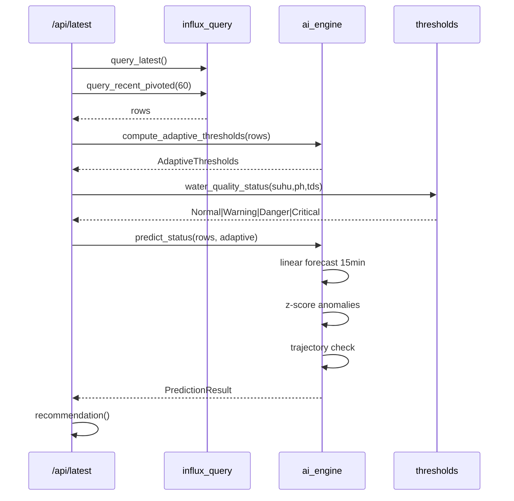

### 11.4 Bukti pengujian AI (unit test)

File: `backend/tests/test_ai_engine.py`

| Test | Verifikasi |
|------|------------|
| `test_water_quality_danger_ph_low` | pH 5.5 → Danger |
| `test_water_quality_critical_ph` | pH 4.0 → Critical |
| `test_predict_status_trajectory_ok` | Data stabil → OK + confidence > 0 |
| `test_compute_adaptive_thresholds` | Mean/std dihitung dari 3 titik |
| `test_zone_for_value` | Mapping ideal/warning/danger/critical |

Jalankan:
```bash
cd backend
python -m pytest tests/test_ai_engine.py -v
```

### 11.5 Roadmap ML (opsional)

Placeholder di `ai_engine.py` untuk penggantian dengan LSTM (`.h5`/`.pkl`):
- Input: sequence 60 timesteps × 3 features
- Output: predicted pH, TDS, suhu +15 min
- Saat ini: linear forecast sudah memenuhi **simulated ML / adaptive logic** untuk Final Project

---

## 12. Frontend Dashboard

**URL:** http://localhost:8081  
**Stack:** React 19 + Vite + Tailwind CSS 4 + Recharts

### Layout

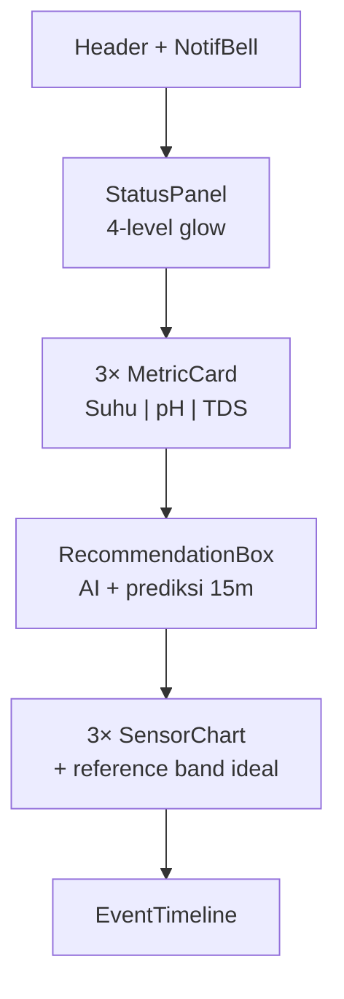

### Palet warna (eye-friendly dark theme)

| Token | Hex | Penggunaan |
|-------|-----|------------|
| Background | `#0f1419` | Halaman |
| Card | `#1a2332` | Panel |
| Safe | `#6ee7b7` | Ideal |
| Warning | `#fcd34d` | Warning |
| Danger | `#fca5a5` | Danger |
| Critical | `#f87171` | Critical |
| Chart suhu | `#5eead4` | Garis suhu |
| Chart pH | `#7dd3fc` | Garis pH |
| Chart TDS | `#c4b5fd` | Garis TDS |

### Polling

- Interval: **30 detik**
- Endpoints: `/api/latest`, `/api/history`, `/api/notifications`, `/api/events`
- Browser Notification: saat `action_required` dan status baru

---

## 13. Grafana

**URL:** http://localhost:3000

### Provisioning otomatis

| File | Fungsi |
|------|--------|
| `grafana/provisioning/datasources/influxdb.yml` | Data source InfluxDB Flux |
| `grafana/provisioning/dashboards/dashboard.yml` | Load dashboard dari folder |
| `grafana/dashboards/tilapia-water-quality.json` | Dashboard 3 panel |

### Dashboard: Tilapia Water Quality

Folder: **Tilapia IoT**  
Panel: Suhu (°C), pH, TDS (ppm) — time-series dari bucket `tilapia_monitoring`  
Refresh: 30 detik  
Time range default: Last 6 hours

Direct link: http://localhost:3000/d/tilapia-water-quality/tilapia-water-quality

### Grafana vs React Dashboard

| Aspek | React (8081) | Grafana (3000) |
|-------|--------------|----------------|
| AI / prediksi | Ya | Tidak |
| Notifikasi | Ya | Tidak |
| Reference band ideal | Ya | Tidak (bisa ditambah) |
| Analitik time-series | Ya | Ya (lebih fleksibel) |
| PostgreSQL events | Ya | Tidak (Influx only) |

---

## 14. Keamanan IoT (Security Layer)

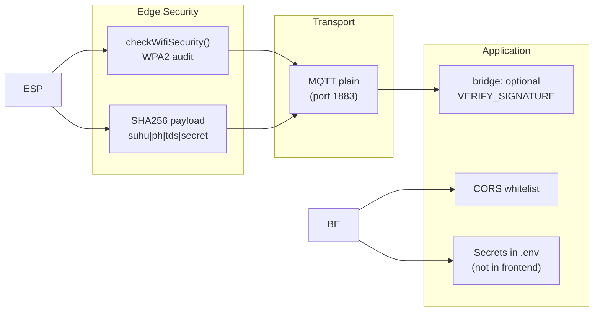

| Layer | Implementasi | File |
|-------|--------------|------|
| WiFi audit | Deteksi OPEN/WEP/WPA2 | `sketch_apr13a.ino` |
| Payload integrity | HMAC-like SHA256 signature | ESP32 + `bridge_s2.py` |
| Secret key | `PAYLOAD_SECRET=tilapia_iot_s2_key` | `.env` |
| Verifikasi bridge | `VERIFY_SIGNATURE=true/false` | `.env` |
| API secrets | Token Influx hanya di backend | `backend/.env` |
| Frontend | Hanya `VITE_API_BASE_URL`, no DB token | `frontend/.env` |

---

## 15. Threshold Kualitas Air Nila

Sumber: `backend/thresholds.py` (selaras ESP32 `classifyStatus`)

### pH

| Zona | Rentang |
|------|---------|
| Ideal | 6.5 – 8.5 |
| Warning | 6.0 – 6.5 atau 8.5 – 9.0 |
| Danger | 5.0 – 6.0 atau 9.0 – 9.5 |
| Critical | < 5.0 atau > 9.5 |

### TDS (ppm)

| Zona | Rentang |
|------|---------|
| Ideal | 100 – 400 |
| Warning | 50 – 100 atau 400 – 500 |
| Danger | 0 – 50 atau 500 – 1000 |
| Critical | > 1000 |

### Suhu (°C)

| Zona | Rentang |
|------|---------|
| Ideal | 26 – 30 |
| Warning | 22 – 26 atau 30 – 33 |
| Danger | 20 – 22 atau 33 – 35 |
| Critical | < 20 atau > 35 |

---

## 16. Kredensial & Akses

### InfluxDB (http://localhost:8086)

| Field | Nilai |
|-------|-------|
| Username | `admin_tilapia` |
| Password | `password_s2_tilapia` |
| Org | `S2_Project` |
| Bucket | `tilapia_monitoring` |
| API Token | File `.env` → `INFLUX_TOKEN` |

### PostgreSQL (localhost:5432)

| Field | Nilai |
|-------|-------|
| Username | `tilapia` |
| Password | `tilapia_s2_secure` |
| Database | `tilapia_analytics` |

### Grafana (http://localhost:3000)

| Field | Nilai |
|-------|-------|
| Username | `admin` |
| Password | `tilapia_grafana_s2` |

### MQTT

| Field | Nilai |
|-------|-------|
| Host | `192.168.43.130` (sesuaikan jaringan) |
| Port | `1883` |
| Topic | `s2/water/monitoring` |

### ESP32 WiFi (firmware)

| Field | Nilai |
|-------|-------|
| SSID | `wifi-mamat` |
| MQTT Server | `192.168.43.130` |

---

## 17. Cara Menjalankan Proyek

### Prerequisites

- Docker Desktop
- Python 3.12+
- Node.js 22+ (untuk dev frontend)
- ESP32 ter-upload firmware
- MQTT broker jalan di LAN

### Langkah 1 — Docker stack

```powershell
cd E:\Users\...\sketch_apr13a
docker compose up --build -d
```

### Langkah 2 — Bridge MQTT

```powershell
pip install -r requirements.txt
python bridge_s2.py
```

### Langkah 3 — ESP32

Upload `sketch_apr13a.ino`, pastikan MQTT broker IP sama dengan `.env`.

### Langkah 4 — Akses UI

| Layanan | URL |
|---------|-----|
| Dashboard React | http://localhost:8081 |
| API Docs | http://localhost:8000/docs |
| Grafana | http://localhost:3000 |
| InfluxDB UI | http://localhost:8086 |

### Verifikasi cepat

```powershell
Invoke-RestMethod http://127.0.0.1:8000/api/health
Invoke-RestMethod http://127.0.0.1:8000/api/latest
docker exec tilapia_postgres psql -U tilapia -d tilapia_analytics -c "SELECT COUNT(*) FROM notifications;"
```

---

## 18. Pengujian & Bukti Implementasi

### Checklist fungsional

| # | Skenario | Bukti |
|---|----------|-------|
| 1 | ESP32 publish MQTT | Serial log `[MQTT] Sent: {...}` |
| 2 | Bridge → InfluxDB | Log `Written to InfluxDB bucket=tilapia_monitoring` |
| 3 | Backend baca Influx | `/api/latest` return suhu/ph/tds |
| 4 | AI prediksi | Field `predicted_ph`, `confidence` di response |
| 5 | PostgreSQL notif | Tabel `notifications` terisi |
| 6 | Event timeline | Tabel `water_quality_events` + UI EventTimeline |
| 7 | Dashboard chart | 3 SensorChart + reference band |
| 8 | Grafana panel | Dashboard Tilapia Water Quality |
| 9 | Edge filter | Log `[EDGE] No significant change` |
| 10 | Unit test AI | `pytest tests/test_ai_engine.py` |

### Perintah test

```bash
# Backend unit tests
cd backend
python -m pytest tests/ -v

# Health check
curl http://127.0.0.1:8000/api/health

# Cek data Influx (Flux via UI atau API)
# Cek PostgreSQL via DBeaver atau:
docker exec tilapia_postgres psql -U tilapia -d tilapia_analytics -c "\dt"
```

---

## 19. Peta File Proyek

```
sketch_apr13a/
├── sketch_apr13a.ino          # Firmware ESP32
├── bridge_s2.py               # MQTT → InfluxDB bridge
├── docker-compose.yml         # Orkestrasi 5 services
├── .env / .env.example        # Bridge + Grafana token
├── DOCUMENTATION.md           # ← Dokumen ini
├── README.md                  # Quick start
├── ARCHITECTURE.md            # Arsitektur ringkas
├── PSEUDOCODE.md              # Pseudocode algoritma
├── SETUP_STACK.md             # Setup Influx + token
│
├── backend/
│   ├── main.py                # FastAPI endpoints
│   ├── ai_engine.py           # AI / prediksi / adaptive
│   ├── thresholds.py          # Batas biologis nila
│   ├── influx_query.py        # Flux queries
│   ├── database.py            # PostgreSQL engine
│   ├── models.py              # ORM tables
│   ├── notification_service.py
│   ├── decision_log.py
│   ├── config.py
│   ├── requirements.txt
│   ├── Dockerfile
│   └── tests/
│       ├── test_ai_engine.py
│       └── test_health.py
│
├── frontend/
│   ├── src/
│   │   ├── App.tsx
│   │   ├── api.ts
│   │   ├── index.css
│   │   └── components/
│   │       ├── StatusPanel.tsx
│   │       ├── MetricCard.tsx
│   │       ├── SensorChart.tsx
│   │       ├── RecommendationBox.tsx
│   │       ├── EventTimeline.tsx
│   │       └── NotifBell.tsx
│   ├── Dockerfile
│   └── nginx.conf
│
└── grafana/
    ├── provisioning/
    │   ├── datasources/influxdb.yml
    │   └── dashboards/dashboard.yml
    └── dashboards/
        └── tilapia-water-quality.json
```

---

## Lampiran — Diagram Deployment Fisik

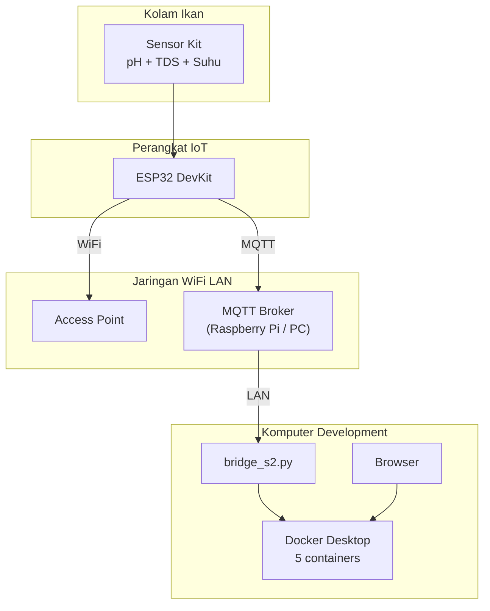

---

_Dokumentasi ini mencakup seluruh alur proyek Smart Water Change Alert System — dari sensor di kolam hingga dashboard, AI prediktif, dan analytics database. Untuk pertanyaan teknis spesifik, lihat kode sumber di path yang disebutkan pada setiap bagian._
