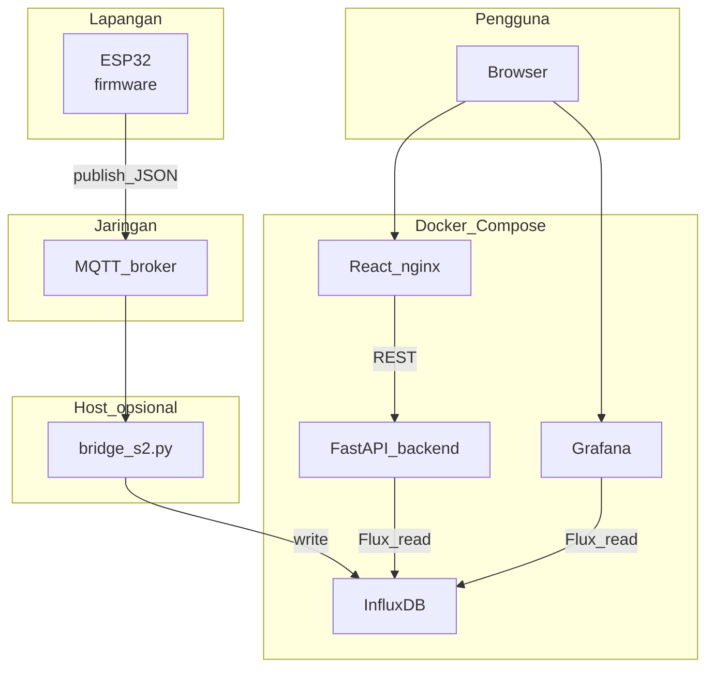

# SMART WATER CHANGE ALERT SYSTEM — Tilapia IoT

Monitoring kualitas air (ESP32 → MQTT → InfluxDB) dengan **API FastAPI**, **dashboard React**, dan **Grafana**.

## Arsitektur (visual)

Diagram berikut **otomatis tampil di GitHub** (Mermaid). Untuk penjelasan lebih detail, port, dan diagram permintaan API, lihat **[ARCHITECTURE.md](ARCHITECTURE.md)**.



## Arsitektur singkat

| Komponen | Port host (default) | Keterangan |
|----------|---------------------|------------|
| InfluxDB | 8086 | Database time-series |
| Grafana | 3000 | Visualisasi analitis |
| Backend API | 8000 | `/api/latest`, `/api/history`, `/api/health` |
| Dashboard web | 8081 | Frontend (nginx, Docker) |
| Vite dev | 5173 | Hanya mode pengembangan |

## Prasyarat & file environment

| File | Kegunaan |
|------|----------|
| **`.env`** (root) | `bridge_s2.py` — MQTT + Influx (bisa sama isi token dengan backend). |
| **`backend/.env`** | FastAPI + `docker compose` service **backend** — **`INFLUX_TOKEN`** dan org/bucket. Salin dari root atau dari [backend/.env.example](backend/.env.example). |
| **`frontend/.env`** | Hanya **`VITE_API_BASE_URL`** (alamat API), **bukan** token Influx. Salin dari [frontend/.env.example](frontend/.env.example). |

Minimal untuk backend:

```env
INFLUX_TOKEN=...   # token API InfluxDB (sama untuk bridge & backend jika satu sumber)
```

Setelah token diganti, perbarui **root `.env`** dan **`backend/.env`** agar konsisten (atau satu sumber: salin lagi dari root ke `backend/.env`).

## Menjalankan seluruh stack (produksi lokal)

Dari root proyek:

```bash
docker compose up --build
```

- API: http://127.0.0.1:8000/docs  
- Dashboard: http://127.0.0.1:8081  
- Grafana: http://127.0.0.1:3000  
- Influx UI: http://127.0.0.1:8086  

Backend memakai `INFLUX_URL=http://influxdb:8086` di dalam jaringan Docker; token/org/bucket dibaca dari **`backend/.env`** (lihat `env_file` di `docker-compose.yml`).

## Pengembangan (tanpa Docker untuk FE/BE)

**Backend:**

```bash
cd backend
pip install -r requirements.txt
# Pastikan backend/.env ada (INFLUX_URL=http://127.0.0.1:8086 untuk Influx lokal)
uvicorn main:app --reload --host 0.0.0.0 --port 8000
```

**Frontend:**

```bash
cd frontend
npm install
copy .env.example .env   # atau set VITE_API_BASE_URL=http://127.0.0.1:8000
npm run dev
```

## MQTT bridge (ESP32 → Influx)

Jalankan di host (bukan wajib di Docker):

```bash
pip install -r requirements.txt
python bridge_s2.py
```

Lihat [SETUP_STACK.md](SETUP_STACK.md) untuk broker dan token.

## Log keputusan (Bab 4 / analisis)

Backend menulis **`backend/logs/decision_logs.csv`** saat status **Danger** atau prediksi **WARNING_CHANGE_WATER**. File CSV tidak di-commit (lihat `.gitignore`).

## Uji backend

```bash
cd backend
pip install -r requirements.txt
python -m pytest tests/ -v
```

## Notifikasi browser

Dashboard meminta izin **Notification** di browser. Di HTTPS/production, kebijakan origin bisa berbeda; di `localhost` biasanya berjalan.

---

Group 1 — S2 / IoT Tilapia
