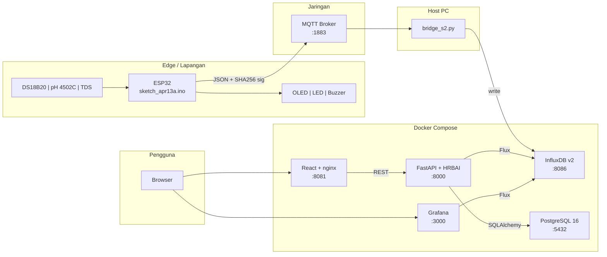

# SMART WATER CHANGE ALERT SYSTEM — Tilapia IoT

Monitoring kualitas air kolam ikan nila (*Oreochromis niloticus*) dengan **ESP32 edge node**, **MQTT event-driven**, **InfluxDB + PostgreSQL dual database**, **FastAPI + HRBAI**, **dashboard React**, dan **Grafana**.

> **Dokumentasi lengkap end-to-end** (ERD, arsitektur, AI/prediktif, flowchart, Docker, kredensial, pengujian): **[DOCUMENTATION.md](DOCUMENTATION.md)**

## Arsitektur (visual)

Diagram berikut **otomatis tampil di GitHub** (Mermaid). Detail port, alur data, dan API: **[ARCHITECTURE.md](ARCHITECTURE.md)**. **Pseudocode** algoritma: **[PSEUDOCODE.md](PSEUDOCODE.md)**.


```mermaid
flowchart LR
  subgraph EDGE["Edge / Lapangan"]
    ESP32["ESP32\nsketch_apr13a.ino"]
    SENS["DS18B20 | pH 4502C | TDS"]
    OLED["OLED | LED | Buzzer"]
    SENS --> ESP32 --> OLED
  end

  subgraph NET["Jaringan"]
    MQTT["MQTT Broker\n:1883"]
  end

  subgraph HOST["Host PC"]
    Bridge["bridge_s2.py"]
  end

  subgraph DOCKER["Docker Compose"]
    Influx["InfluxDB v2\n:8086"]
    PG["PostgreSQL 16\n:5432"]
    Backend["FastAPI + HRBAI\n:8000"]
    Front["React + nginx\n:8081"]
    Grafana["Grafana\n:3000"]
  end

  subgraph USER["Pengguna"]
    Browser["Browser"]
  end

  ESP32 -->|"JSON + SHA256 sig"| MQTT
  MQTT --> Bridge
  Bridge -->|"write"| Influx
  Backend -->|"Flux"| Influx
  Backend -->|"SQLAlchemy"| PG
  Grafana -->|"Flux"| Influx
  Browser --> Front
  Browser --> Grafana
  Front -->|"REST"| Backend
```

## Fitur utama

| Fitur | Implementasi |
|-------|----------------|
| Monitoring real-time | ESP32 + OLED + MQTT (interval 5 detik) |
| Time-series storage | InfluxDB v2, bucket `tilapia_monitoring` |
| Analytics & alert | PostgreSQL — notifikasi, events, decision log |
| Adaptive intelligence | HRBAI — baseline adaptif, forecast 15 min, z-score anomaly |
| Notifikasi | PostgreSQL + NotifBell UI + browser notification |
| Visualisasi | React dashboard (3 chart) + Grafana provisioning |
| Edge optimization | Filter delta sebelum publish MQTT |
| Keamanan IoT | SHA256 payload signature, audit WiFi WPA2 |
| Orkestrasi | Docker Compose (5 services) |

## Arsitektur singkat

| Komponen | Port host | Keterangan |
|----------|-----------|------------|
| InfluxDB | 8086 | Time-series sensor (raw) |
| PostgreSQL | 5432 | Analytics: notif, events, decision log |
| Grafana | 3000 | Visualisasi analitis (Flux, auto-provisioned) |
| Backend API | 8000 | REST + HRBAI — lihat `/docs` |
| Dashboard web | 8081 | Frontend React (nginx, Docker) |
| Vite dev | 5173 | Hanya mode pengembangan |
| MQTT bridge | — | `bridge_s2.py` di **host** (bukan Docker) |

## Prasyarat & file environment

| File | Kegunaan |
|------|----------|
| **`.env`** (root) | `bridge_s2.py` — MQTT, Influx, `PAYLOAD_SECRET`, `VERIFY_SIGNATURE` |
| **`backend/.env`** | FastAPI + Docker service **backend** — `INFLUX_TOKEN`, `DATABASE_URL` |
| **`frontend/.env`** | Hanya **`VITE_API_BASE_URL`** — bukan token Influx |

Salin dari [`.env.example`](.env.example), [`backend/.env.example`](backend/.env.example), [`frontend/.env.example`](frontend/.env.example).

## Menjalankan seluruh stack

Dari root proyek:

```powershell
docker compose up --build -d
pip install -r requirements.txt
python bridge_s2.py
```

| Layanan | URL |
|---------|-----|
| Dashboard React | http://127.0.0.1:8081 |
| API Docs (Swagger) | http://127.0.0.1:8000/docs |
| Grafana | http://127.0.0.1:3000 |
| InfluxDB UI | http://127.0.0.1:8086 |

Detail setup token, Grafana, dan verifikasi: **[SETUP_STACK.md](SETUP_STACK.md)**.

## Pengembangan (tanpa Docker untuk FE/BE)

**Backend:**

```powershell
cd backend
pip install -r requirements.txt
# backend/.env: INFLUX_URL=http://127.0.0.1:8086, DATABASE_URL=...
uvicorn main:app --reload --host 0.0.0.0 --port 8000
```

**Frontend:**

```powershell
cd frontend
npm install
copy .env.example .env
npm run dev
```

## API endpoints (ringkas)

| Endpoint | Sumber | Deskripsi |
|----------|--------|-----------|
| `GET /api/health` | — | Health check |
| `GET /api/latest` | InfluxDB + AI + PG | Snapshot + prediksi + notifikasi |
| `GET /api/history` | InfluxDB | Time-series 24 jam |
| `GET /api/notifications` | PostgreSQL | Daftar alert |
| `GET /api/events` | PostgreSQL | Timeline perubahan status |
| `GET /api/decisions` | PostgreSQL | Log keputusan AI |
| `GET /api/thresholds` | `thresholds.py` | Batas biologis nila |

Daftar lengkap: [DOCUMENTATION.md §8](DOCUMENTATION.md#8-backend-api) atau http://127.0.0.1:8000/docs

## Log keputusan & notifikasi

Backend menulis ke **PostgreSQL** (`decision_logs`, `notifications`, `water_quality_events`) saat status **Danger/Critical** atau prediksi **WARNING_CHANGE_WATER**. CSV opsional di `backend/logs/`.

## Uji backend

```powershell
cd backend
python -m pytest tests/ -v
```

## Struktur proyek

```
sketch_apr13a/
├── sketch_apr13a.ino      # Firmware ESP32
├── bridge_s2.py           # MQTT → InfluxDB bridge
├── docker-compose.yml     # 5 services
├── backend/               # FastAPI + HRBAI + PostgreSQL
├── frontend/              # React dashboard
├── grafana/               # Provisioning datasource + dashboard
├── DOCUMENTATION.md       # Dokumentasi master
├── ARCHITECTURE.md        # Diagram arsitektur
├── PSEUDOCODE.md          # Pseudocode algoritma
└── SETUP_STACK.md         # Setup Influx, Grafana, bridge
```

## Notifikasi browser

Dashboard meminta izin **Notification** di browser. Di `localhost` biasanya berjalan; di production HTTPS kebijakan origin bisa berbeda.

---

**Group 1 — S2 / IoT Tilapia**
